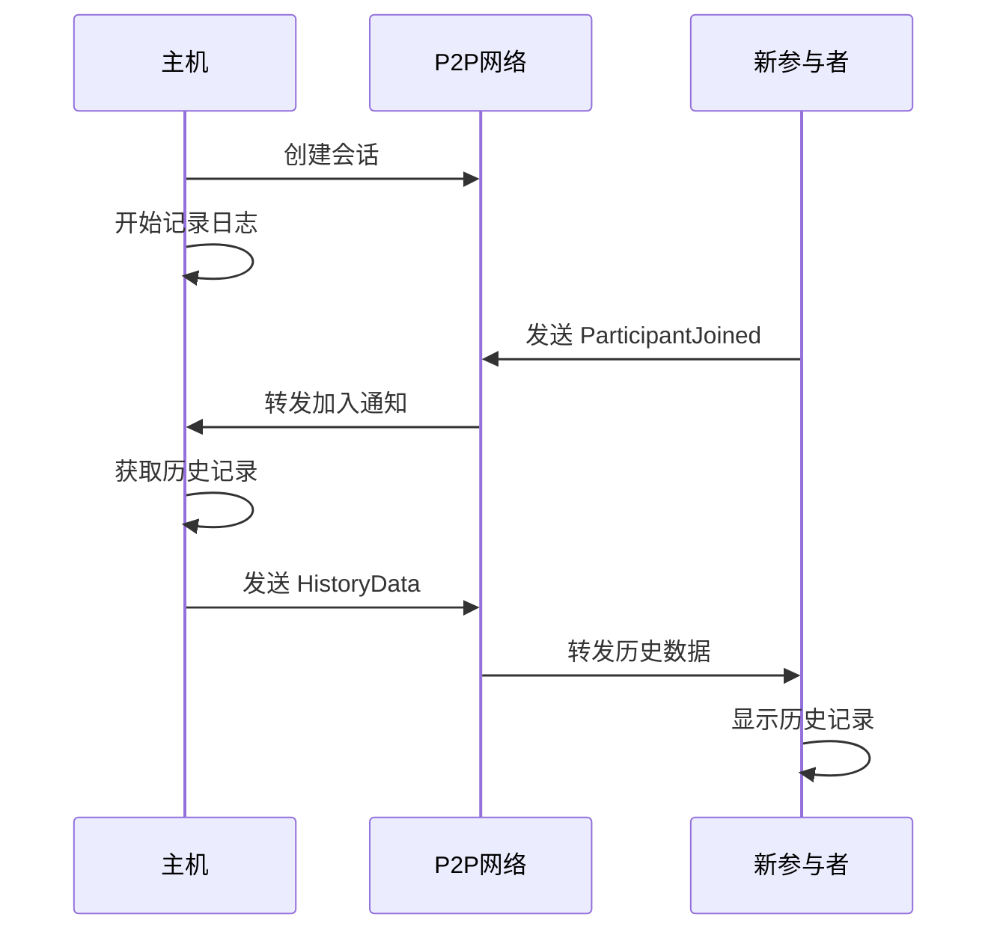

# riterm - P2P Terminal Session Sharing

一个基于 iroh P2P 网络的终端会话共享工具，支持实时协作和历史记录自动同步。

## ✨ 核心功能

### 🔄 实时终端共享
- 多人实时共享同一个终端会话
- 支持所有主流 Shell（zsh, bash, fish, nushell, powershell）
- 跨平台支持（Windows, macOS, Linux）

### 📜 智能历史记录
- **自动日志记录**：所有终端输出自动保存到 `logs/{session_id}.log`
- **历史消息发送**：新参与者加入时自动接收完整会话历史
- **会话信息完整**：包含 Shell 类型、工作目录、完整输出历史
- **格式化显示**：`{logs: xxx, shell: zsh, cwd: ~/project}`

### 🔐 安全 P2P 通信
- 基于 iroh 的去中心化 P2P 网络
- ChaCha20Poly1305 端到端加密
- 无需中央服务器，支持 NAT 穿透
- 会话票据（Session Ticket）安全分发

### 📱 多平台支持
- **Web 应用**：基于 React 的现代化 Web 界面，支持响应式设计
- **桌面应用**：基于 Tauri 的原生桌面应用，支持 Windows、macOS、Linux
- **Android 应用**：原生 Android 应用，支持移动设备操作
- **CLI 工具**：跨平台命令行工具，适用于服务器和自动化场景

### 🎯 易用性
- 简单的命令行界面
- QR 码分享会话票据
- 自动 Shell 检测

## 🚀 快速开始

### 安装

#### CLI 工具

```bash
# 克隆项目
git clone https://github.com/your-username/riterm.git
cd riterm

# 编译 CLI 工具
cd cli
cargo build --release
```

#### Web 应用

```bash
# 安装依赖并启动开发服务器
npm install
npm run dev
```

#### Android 应用

```bash
# 构建 Android APK
npm run tauri android build

# 开发模式运行
npm run tauri android dev
```

#### 桌面应用

```bash
# 构建桌面应用
npm run tauri build
```

### 基本使用

#### 1. 启动主机会话

```bash
# 使用默认 shell
./cli/target/release/cli host

# 指定 shell 类型
./cli/target/release/cli host --shell zsh

# 自定义终端大小
./cli/target/release/cli host --width 120 --height 30
```

输出示例：
```
🚀 Starting shared terminal session...
📋 Session ID: 550e8400-e29b-41d4-a716-446655440000
🐚 Shell: Zsh (/bin/zsh)
📏 Size: 80x24

🎫 Session Ticket: MFRGG43FMVZXG5DFON2HE2LTMVZXG5DF...
💡 Others can join using: roterm join MFRGG43F...
```

#### 2. 加入会话

```bash
# 使用会话票据加入
./cli/target/release/cli join MFRGG43FMVZXG5DFON2HE2LTMVZXG5DF...
```

新参与者会自动接收完整的会话历史：
```
📜 Session History (Shell: zsh, CWD: ~/project)
$ pwd
/Users/username/project
$ ls -la
total 48
drwxr-xr-x  12 user  staff   384 Jan 21 11:00 .
...
--- End of History ---
```

#### 3. 其他功能

```bash
# 列出活跃会话
./cli/target/release/cli list

# 播放录制的会话
./cli/target/release/cli play session.json

# 查看可用的 shell
./cli/target/release/cli host --list-shells
```

## 🏗️ 项目结构

```
riterm/
├── cli/                    # CLI 工具（Rust）
│   ├── src/
│   │   ├── main.rs        # 程序入口
│   │   ├── cli.rs         # 命令行界面
│   │   ├── p2p.rs         # P2P 网络通信
│   │   ├── terminal.rs    # 终端录制和管理
│   │   └── shell.rs      # Shell 检测和配置
│   └── Cargo.toml
├── app/                    # Tauri 多平台应用
│   ├── src/
│   │   ├── main.rs        # Tauri 后端
│   │   ├── lib.rs         # 库入口
│   │   ├── p2p.rs         # P2P 集成
│   │   └── terminal_events.rs
│   ├── gen/               # 生成的移动端代码
│   │   ├── android/       # Android 项目文件
│   │   └── apple/         # iOS 项目文件
│   ├── icons/            # 应用图标
│   ├── capabilities/     # Tauri 权限配置
│   └── Cargo.toml
├── src/                    # React 前端
│   ├── components/        # UI 组件
│   │   ├── ui/           # 基础 UI 组件
│   │   ├── ConnectionView.tsx
│   │   ├── TerminalView.tsx
│   │   ├── HomeView.tsx
│   │   └── SettingsModal.tsx
│   ├── hooks/            # React Hooks
│   ├── stores/           # 状态管理
│   └── utils/            # 工具函数
├── examples/              # 使用示例
├── logs/                 # 会话日志文件
└── dist/                 # 构建输出
```

## 🔧 技术架构

### 核心组件

#### 1. P2P 网络层 (`cli/src/p2p.rs`)
- **P2PNetwork**：管理 P2P 连接和消息路由
- **EncryptedTerminalMessage**：加密消息传输
- **SessionTicket**：会话票据生成和解析
- **历史记录回调**：自动发送历史给新参与者

#### 2. 终端管理 (`cli/src/terminal.rs`)
- **TerminalRecorder**：终端会话录制和管理
- **LogRecorder**：日志文件记录
- **SessionInfo**：会话信息（logs, shell, cwd)

#### 3. Shell 支持 (`cli/src/shell.rs`)
- **ShellDetector**：自动检测可用 Shell
- **ShellConfig**：各种 Shell 的配置管理
- 支持：Zsh, Bash, Fish, Nushell, PowerShell

### 消息流程



## 📊 功能特性

### ✅ 已实现功能

- [x] **实时终端共享**：多人同时操作同一终端
- [x] **历史记录自动发送**：新参与者自动接收完整历史
- [x] **日志文件记录**：所有会话自动保存到文件
- [x] **多 Shell 支持**：支持主流 Shell 和跨平台
- [x] **加密通信**：端到端加密保证安全性
- [x] **会话管理**：创建、加入、列出、录制会话
- [x] **QR 码分享**：便捷的会话票据分享
- [x] **自动重连**：网络中断后自动重连
- [x] **Web 界面**：基于 React 的响应式 Web 管理界面
- [x] **Android 应用**：原生 Android 应用支持
- [x] **移动优先设计**：针对移动设备优化的 UI/UX
- [x] **自动发布**：CI/CD 自动化构建和发布流程
- [x] **性能优化**：生产版本移除调试跟踪，提升性能

### 🔄 进行中功能

- [ ] **iOS 应用**：原生 iOS 应用开发
- [ ] **会话权限管理**：只读/读写权限控制
- [ ] **文件传输**：会话中的文件共享功能

### 🎯 计划功能

- [ ] **协作编辑**：多人同时编辑文件
- [ ] **语音通话**：集成语音通信
- [ ] **屏幕共享**：桌面屏幕共享
- [ ] **插件系统**：扩展功能支持

## 🧪 测试

### 运行测试

```bash
# 编译测试
cd cli && cargo test

# 功能测试
./test_history_sending.sh

# 性能测试
./benchmark_history.sh
```

### 测试覆盖

- ✅ P2P 网络连接测试
- ✅ 消息加密/解密测试
- ✅ 历史记录发送测试
- ✅ Shell 检测测试
- ✅ 会话管理测试

## 📖 使用示例

详细的使用示例请参考：[examples/history_demo.md](examples/history_demo.md)

## 🤝 贡献

欢迎贡献代码！请遵循以下步骤：

1. Fork 项目
2. 创建功能分支 (`git checkout -b feature/amazing-feature`)
3. 提交更改 (`git commit -m 'Add amazing feature'`)
4. 推送到分支 (`git push origin feature/amazing-feature`)
5. 创建 Pull Request

## 📄 许可证

本项目采用 MIT 许可证 - 详见 [LICENSE](LICENSE) 文件。

## 🙏 致谢

- [iroh](https://github.com/n0-computer/iroh) - 强大的 P2P 网络库
- [tokio](https://tokio.rs/) - 异步运行时
- [tauri](https://tauri.app/) - 跨平台桌面应用框架
- [crossterm](https://github.com/crossterm-rs/crossterm) - 跨平台终端操作

## 📞 联系

- 项目主页：https://github.com/your-username/riterm
- 问题反馈：https://github.com/your-username/riterm/issues
- 讨论区：https://github.com/your-username/riterm/discussions

---

**riterm** - 让终端协作变得简单！ 🚀